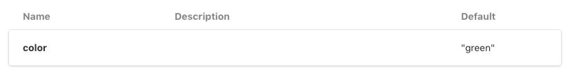
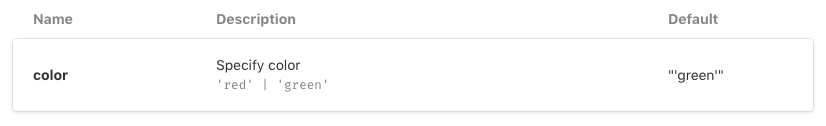

# Storybook - CRA Emotion CSS Issue

When using the jsx pragma for the css prop from emotion, storybook's docs addon
does not render propType descriptions.

Check the `EmotionExample` for an example of where this fails.

Then check the `NormalExample` to see it work fine.

